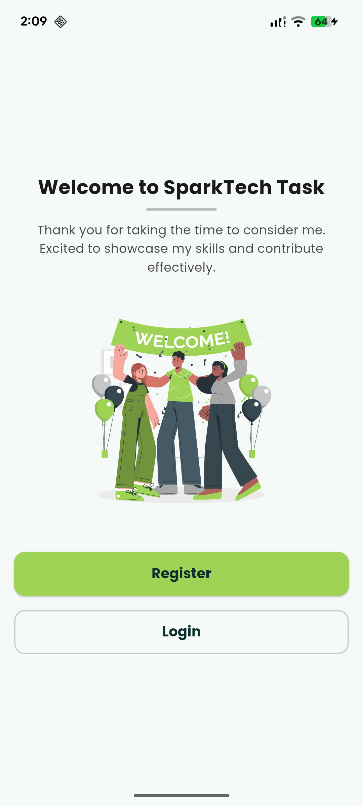
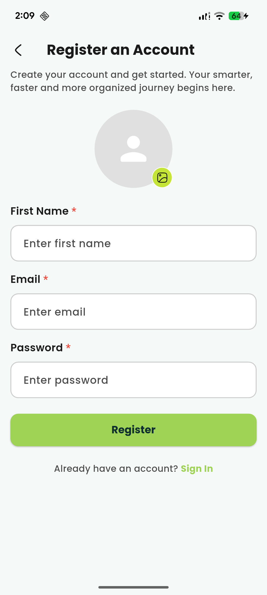
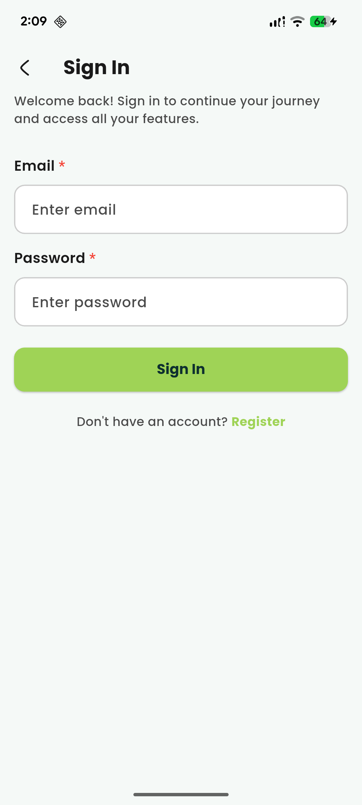
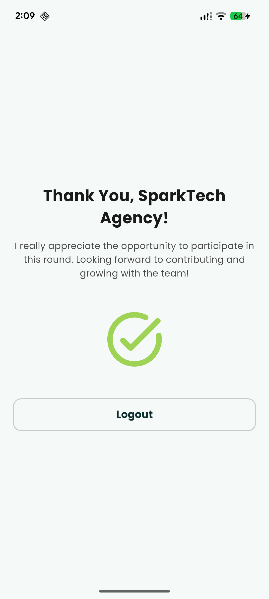

# Sparktech Agency Task

A Flutter application developed as a technical assessment for **Sparktech Agency** interview process. This app demonstrates authentication flow implementation including user registration, OTP verification, and login functionality.

## Features

- **User Registration**: Create new account with profile image upload
- **OTP Verification**: Email-based OTP verification system
- **User Login**: Secure authentication with token management
- **Dashboard**: Protected route after successful authentication
- **State Management**: BLoC pattern implementation
- **Form Validation**: Email and password validation
- **Error Handling**: User-friendly error messages and toast notifications
- **Loading States**: Visual feedback during API calls
- **Onboarding**: Splash screen and welcome page

## Tech Stack

- **Framework**: Flutter
- **State Management**: flutter_bloc
- **HTTP Client**: Dio
- **Local Storage**: SharedPreferences
- **UI Components**: Material Design with custom widgets
- **Fonts**: Google Fonts

## Architecture

The app follows **Clean Architecture** principles with clear separation of concerns:

```
lib/
├── core/
│   ├── constants/          # API endpoints, colors, asset paths
│   ├── services/           # App preferences, local storage
│   ├── utils/
│   │   └── themes/         # App theming (AppBar, Buttons, Inputs)
│   └── widgets/            # Reusable UI components
│
└── features/
    ├── onboarding/         # Splash & Welcome screens
    │   └── presentation/
    │       └── pages/
    │
    ├── auth/               # Authentication feature
    │   ├── data/
    │   │   ├── models/
    │   │   └── repositories/    # API integration layer
    │   └── presentation/
    │       ├── blocs/           # State management (Login, Register, OTP)
    │       ├── pages/           # UI screens
    │       └── widgets/         # Feature-specific widgets
    │
    └── dashboard/          # Main app dashboard
        ├── data/
        └── presentation/
            └── pages/
```

## Getting Started

### Prerequisites

- Flutter SDK (3.0.0 or higher)
- Dart SDK
- Android Studio / VS Code
- Android/iOS Emulator or Physical Device

### Installation

1. Clone the repository
```bash
git clone https://github.com/DevNadimm/sparktech_agency_task
cd sparktech_agency_task
```

2. Install dependencies
```bash
flutter pub get
```

3. Run the app
```bash
flutter run
```

## Authentication Flow

1. **Splash Screen** → App initialization
2. **Welcome Page** → Onboarding introduction
3. **Register** → User creates account with email, password, and optional profile image
4. **Verify OTP** → User receives OTP via email and verifies their account
5. **Login** → User signs in with verified credentials
6. **Dashboard** → Access protected features with JWT authentication

## Key Implementation Highlights

### Architecture & Design Patterns
- **Feature-based folder structure** for scalability
- **BLoC Pattern** for reactive state management
- **Repository Pattern** for clean API integration
- **Separation of concerns** (Data layer, Business logic, Presentation)

### Code Quality
- **Custom reusable widgets** (CustomTextField, Loader, AppNotifier)
- **Centralized theming** for consistent UI
- **Form validation** with real-time feedback
- **Error handling** with comprehensive exception management

### Technical Features
- **Token Management**: Secure storage of access and refresh tokens
- **Multipart/Form-Data**: Image upload with user registration
- **BLoC Events & States**: Clean event-driven architecture
- **Custom AppBar & Buttons**: Themed Material Design components
- **Responsive UI**: Adaptive layouts with proper spacing

## Project Structure Details

### Core Layer
- **constants/**: API endpoints, colors, asset paths, preference keys
- **services/**: AppPreferences for local data storage
- **themes/**: Centralized Material Design theming
- **widgets/**: Reusable components (TextField, Loader, Notifier, AppBar)

### Features Layer
- **onboarding/**: Splash screen and welcome page
- **auth/**: Complete authentication module with repositories and BLoCs
- **dashboard/**: Post-authentication user dashboard

## API Integration

The app integrates with a RESTful API for:
- **User Registration**: POST with multipart/form-data (profile image upload)
- **OTP Verification**: POST with email and OTP code
- **User Login**: POST with email and password
- **Token Storage**: Access and refresh tokens saved locally

## Screenshots

### Welcome Page


### Register Page


### Login Page


### Dashboard Page


## Dependencies

Key packages used:
- `flutter_bloc` - State management
- `dio` - HTTP client
- `shared_preferences` - Local storage
- `google_fonts` - Custom typography
- `image_picker` - Profile image selection

## Contact

Developed by Nadim Chowdhury for Sparktech Agency technical assessment.

---

**Note**: This is a demonstration project created for interview purposes showcasing Flutter development best practices and clean architecture principles.